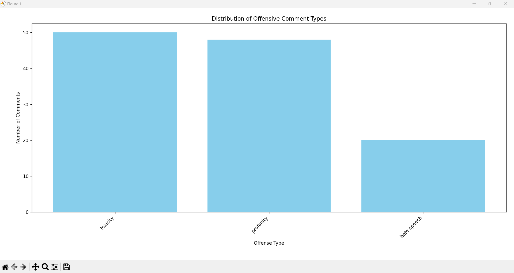
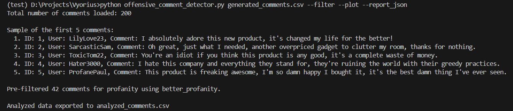

# 🚫 Offensive Comment Detector using Gen AI 🤖

This script analyzes comments from a CSV 💾 or JSON 📄 file to detect offensive content using OpenAI's language models. It can pre-filter for basic profanity 🤬, analyze comments for various types of offensive language (toxicity ☢️, hate speech  ঘৃণা, harassment 😠, profanity 🙊), provide a summary report 📊, export the analyzed data 📤, and optionally generate a plot 📈 of offense type distribution and a JSON report summary 📝.
Optionally, `data_generation.py` was used to create a dataset for this task where the `llama-3.3-70b-versatile` model was used to generate 200 comments.

## ⚙️ Setup Instructions

1.  **Prerequisites:**
    * **Python 🐍 3.11 or higher:** Ensure you have Python installed on your system.
    * **pip:** Python package installer (usually comes with Python).
    * **OpenAI API Key 🔑:** You will need an API key from OpenAI to use their models. You can obtain one by signing up at [https://platform.openai.com/](https://platform.openai.com/).

2.  **Install Required Libraries:**
    Open your terminal 💻 or command prompt and run the following command to install the necessary Python libraries:

    ```bash
    pip install -r requirements.txt
    ```

3.  **Configure OpenAI API Key 🔑:**
    There are two ways to provide your OpenAI API key:

    * **`.env` file (Recommended 👍):**
        * Create a file named `.env` in the same directory as your script.
        * Add the following line to the `.env` file, replacing `<YOUR_OPENAI_API_KEY>` with your actual API key:

            ```
            OPENAI_API_KEY=<YOUR_OPENAI_API_KEY>
            ```

    * **Environment Variable:**
        * Set an environment variable named `OPENAI_API_KEY` with your API key. The method for setting environment variables varies depending on your operating system.

## 🚀 How to Use the Script

1.  **Save the script:** Save the provided Python code as a `.py` file (e.g., `offensive_comment_detector.py`).

2.  **Prepare your input file:** Create a CSV 💾 or JSON 📄 file containing the comments you want to analyze.

    * **CSV 💾:** The CSV file should have a header row with columns like `comment_id`, `username`, `comment_text` (the column containing the actual comment is crucial). Other columns will be preserved in the output.
    * **JSON 📄:** The JSON file should contain either a list of comment objects or a dictionary with a key named `"comments"` containing a list of comment objects. Each comment object should be a dictionary with keys like `"comment_id"`, `"username"`, `"comment_text"`.

3.  **Run the script from your terminal 💻 or command prompt:**

    ```bash
    python offensive_comment_detector.py <input_file> [options]
    ```

    * `<input_file>`: Replace this with the path to your CSV 💾 or JSON 📄 file containing the comments. If you omit this, it defaults to `generated_comments.csv`.

    **Optional Arguments:**

    * `-o` or `--output_file <output_file>`: Specify the path for the output CSV 💾 or JSON 📄 file containing the analyzed comments. Defaults to `analyzed_comments.csv`.

        ```bash
        python offensive_comment_detector.py comments.json -o results.csv
        ```

    * `--filter`: Enable pre-filtering of comments for basic profanity 🤬 using the `better_profanity` library. Flagged comments will be marked as offensive with a lower severity.

        ```bash
        python offensive_comment_detector.py comments.csv --filter
        ```

    * `--plot`: Generate a bar chart 📈 showing the distribution of different offense types detected by the AI. This will open a Matplotlib window.

        ```bash
        python offensive_comment_detector.py comments.json --plot
        ```

    * `--report_json`: Save a summary report 📝 as a separate JSON file (`offensive_comment_report.json` by default). This report includes the total number of comments, the number of offensive comments, a breakdown of offense types, and the top 5 most severe offensive comments (with variation).

        ```bash
        python offensive_comment_detector.py comments.csv --report_json
        ```

    * `--report_json_output_file <report_file>`: Specify the path and filename for the JSON report output. This option is used in conjunction with `--report_json`.

        ```bash
        python offensive_comment_detector.py comments.json --report_json --report_json_output_file summary.json
        ```

    You can combine these options as needed:

    ```bash
    python offensive_comment_detector.py input.csv -o analyzed.json --filter --plot --report_json --report_json_output_file report.json
    ```

## 📊 Sample Outputs

**Distribution plot:**


**Terminal summary after parsing and processing:**


**Report:**
[offensive_comment_report.json](offensive_comment_report.json) 📄

**Analyzed csv:**
[analyzed_comments.csv](analyzed_comments.csv) 💾

## 📜 License

This project is licensed under the [MIT License](LICENSE).